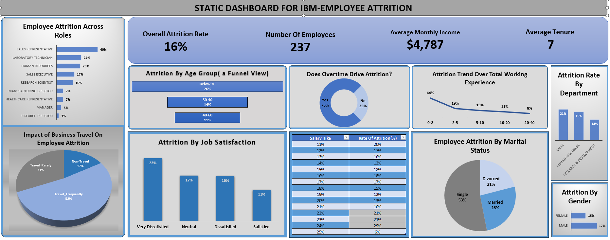
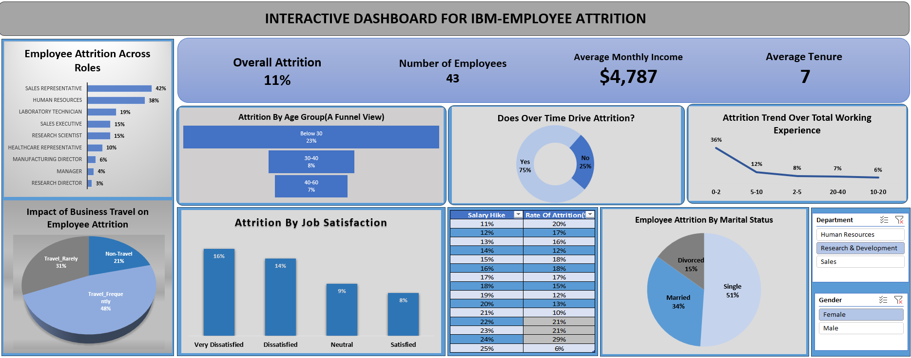

# IBM HR Analytics – Employee Attrition Analysis

## Project Overview
This project performs a comprehensive analysis of the IBM HR Employee Attrition dataset using Microsoft Excel. 
It includes data cleaning, exploratory data analysis, and interactive dashboards (both static and dynamic) to uncover trends and key factors affecting employee attrition. 
The goal is to provide actionable insights to help HR teams reduce attrition and improve employee retention.

## Skills & Tools Used
- Microsoft Excel (Formulas, Pivot Tables, Pivot Charts)
- Data Cleaning & Preparation
- Conditional Formatting & Interactive Dashboards
- Data Visualization & Trend Analysis
- Documentation & Reporting

## Project Contents
All files are contained in the folder `IBM-HR-ATTRITION ANALYSIS`:
- `IBM-HR-Analytics.xlsx` – Main Excel file with data and dashboards  
- `Static_Dashboard.png` – Screenshot of the static dashboard  
- `Dynamic_Dashboard.png` – Screenshot of the interactive/dynamic dashboard  
- `Project_Documentation.pdf` – Detailed project documentation  

## Dashboard Screenshots

### Static Dashboard

### Dynamic Dashboard

## Key Insights
- Trends in employee attrition across departments and job roles  
- Key performance and satisfaction metrics influencing attrition  
- Relationship between work-life balance, job satisfaction, and attrition  
- Recommendations for HR policies to reduce attrition based on analysis  

## How to Explore
1. Download the repository.  
2. Open the Excel file in Microsoft Excel (2016 or later recommended).  
3. Explore static and dynamic dashboards, pivot tables, and charts.  
4. Refer to the documentation PDF for detailed insights and methodology.
